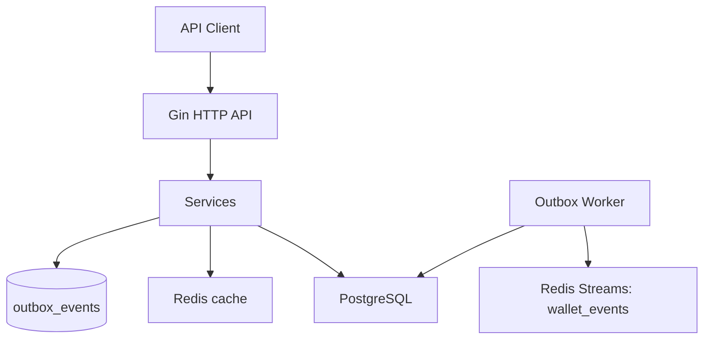
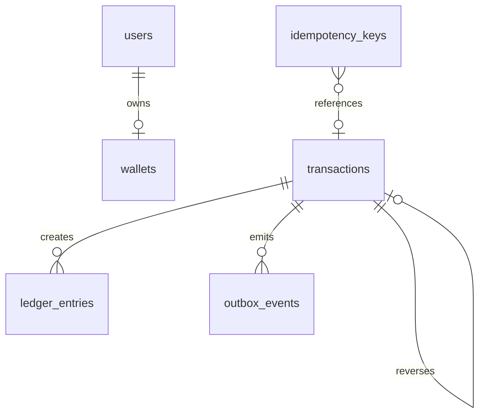

# go-digital-wallet

## Features

- User CRUD with soft delete
- One-wallet-per-user creation and wallet status management
- Wallet balance reads with Redis cache fallback to PostgreSQL
- Top-up, transfer, transaction history, transaction detail, and reversal APIs
- Append-only transactions with double-entry ledger rows
- Idempotent transaction writes backed by PostgreSQL
- Transactional outbox persisted in PostgreSQL
- Redis Stream publication to `wallet_events`
- Structured request logging with request IDs
- SQLite-backed service tests plus Docker Compose for local runtime

## Architecture



## Data Model



Main tables:

- `users`
- `wallets`
- `transactions`
- `ledger_entries`
- `idempotency_keys`
- `outbox_events`

The service seeds a system settlement user and wallet automatically to keep top-ups double-entry balanced.

## Top-Up Modeling

`POST /api/v1/transactions/topup` is modeled as an internal transfer from `SystemWallet` to the destination wallet.

- `SystemWallet` is not a customer wallet. It represents the platform's internal settlement account.
- In business terms, it simulates money arriving from an external bank or payment rail into the wallet system.
- This keeps the ledger double-entry even for top-ups: debit `SystemWallet`, credit the user's wallet.
- `SystemWallet` may become negative in this MVP. That is intentional here because it stands in for external funding, not a normal end-user balance that must obey overdraft rules.

## Run with Docker

1. Start the stack:

```bash
docker compose up --build
```

2. Import Postman files for test api:

- `docs/postman/digital-wallet-service.postman_collection.json`

## Test

```bash
go test ./...
go test -race ./...
go vet ./...
```

If `golangci-lint` is installed:

```bash
golangci-lint run
```

## API Examples

Create a user:

```bash
curl -X POST http://localhost:8080/api/v1/users \
  -H 'Content-Type: application/json' \
  -d '{
    "full_name": "Alice Example",
    "email": "alice@example.com",
    "phone_number": "0812345678"
  }'
```

Create a wallet:

```bash
curl -X POST http://localhost:8080/api/v1/wallets \
  -H 'Content-Type: application/json' \
  -d '{
    "user_id": "REPLACE_WITH_USER_ID"
  }'
```

Top up a wallet:

```bash
curl -X POST http://localhost:8080/api/v1/transactions/topup \
  -H 'Content-Type: application/json' \
  -H 'Idempotency-Key: topup-001' \
  -d '{
    "wallet_id": "REPLACE_WITH_WALLET_ID",
    "amount_minor": 10000
  }'
```

Transfer between wallets:

```bash
curl -X POST http://localhost:8080/api/v1/transactions/transfer \
  -H 'Content-Type: application/json' \
  -H 'Idempotency-Key: transfer-001' \
  -d '{
    "source_wallet_id": "SOURCE_WALLET_ID",
    "destination_wallet_id": "DESTINATION_WALLET_ID",
    "amount_minor": 2500
  }'
```

Reverse a transaction:

```bash
curl -X POST http://localhost:8080/api/v1/transactions/TRANSACTION_ID/reverse \
  -H 'Idempotency-Key: reversal-001'
```

## Inspect Events

Read stream events from Redis:

```bash
docker compose exec redis redis-cli XRANGE wallet_events - +
```

Pending outbox rows in PostgreSQL:

```bash
docker compose exec postgres psql -U testWallet -d wallet_service -c \
  "SELECT id, event_type, status, retry_count, created_at FROM outbox_events ORDER BY created_at DESC;"
```

## Notable Design Choices

- Balances are stored as integer minor units.
- Top-up is implemented via an internal `SystemWallet` to simulate incoming funds from a bank while keeping double-entry bookkeeping.
- Wallet balance reads prefer Redis but fall back to PostgreSQL.
- Money movement runs inside a single database transaction.
- Transfers lock wallet rows in deterministic order to avoid deadlocks.
- Reversal is modeled as a new compensating transaction.
- The API does not depend on Redis availability for successful writes.